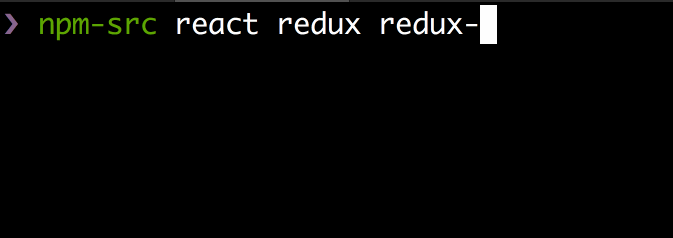

# npm-src [](https://travis-ci.org/akameco/npm-src)

[](https://greenkeeper.io/)

> GHQ for npm



## Install

```
$ npm install --global npm-src
```

## Required

- [motemen/ghq: Remote repository management made easy](https://github.com/motemen/ghq)

## Usage

```
$ npm-src --help

  ghq for npm

  Usage
    $ npm-src <package name> [string, array]

  Examples
    $ npm-src ava xo
```


## License

MIT © [akameco](http://akameco.github.io)
